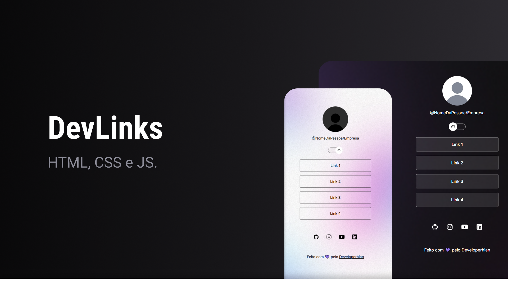

# 🚀 DevLinks

  

> Uma aplicação moderna e responsiva do tipo "link-in-bio", desenvolvida para centralizar redes sociais profissionais e conexões digitais numa única interface limpa, acessível e elegante.

---

## 🎯 Sobre o Projeto

O **DevLinks** é uma aplicação front-end desenvolvida para resolver um desafio comum no dia a dia: partilhar múltiplos links de forma profissional e organizada em plataformas como GitHub, LinkedIn e redes sociais. 

Construído com um forte foco em arquitetura de código limpo e experiência de utilizador (UX), este projeto conta com um sistema nativo de **Modo Claro/Escuro (Dark/Light Mode)**, variáveis de estilo customizadas e um layout totalmente responsivo otimizado para dispositivos móveis e computadores.

---

## 🛠️ Tecnologias Utilizadas

Este projeto foi desenvolvido utilizando tecnologias web modernas e essenciais, sem o uso de frameworks pesados:

* **HTML5**: Estruturação semântica e acessível da página.
* **CSS3**: Estilização moderna, propriedades customizadas (variáveis), Flexbox e design responsivo.
* **JavaScript (ES6+)**: Manipulação do DOM e gestão dinâmica do estado do tema.
* **Git & GitHub**: Controlo de versão e gestão do repositório remoto.

---

## ✨ Funcionalidades Principais

* **Alternância de Tema Dinâmica**: Transição fluida entre o Modo Claro e Escuro com persistência visual.
* **Design Totalmente Responsivo**: Layout otimizado para garantir uma experiência perfeita em smartphones, tablets e desktops.
* **UI/UX Limpa**: Estética minimalista focada na legibilidade e no acesso rápido aos links profissionais.

---

  Desenvolvido com 💜 por <b>Developerhian</b>. Deixa uma estrela se o projeto te foi útil! ⭐️

